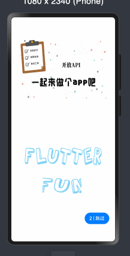
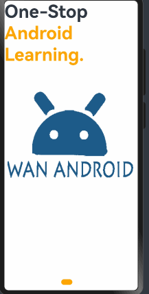

# HarmonyWanAndroid

A new Wan Android Harmony client.

## Getting Started
本项目采用了原始的架构，所有接口在viewmodel目录下，所有页面在pages下，用到的一些widget或者组件在View下。
另外试验性使用了clean architecture，这部分依赖DI容器[inversify](https://ohpm.openharmony.cn/#/cn/detail/inversify)。
相关试验模块为core和src下的auth。clean architecture代码量会比较大，但是数据相关部分(data目录下)看起来比较流畅，没有tricky代码。

## 交互设计原则
### GET接口指示：
1. 上拉下拉刷新可以由头部、底部视图进行指示。(adopted)
2. 初次进入展示缓存数据时，展示头部刷新视图。不展示缓存数据时，需要Loading toast。
3. 刷新、加载更多也可使用toast，遮挡型会阻止用户滚动，但可以避免重复刷新和加载的问题。否则需要锁定，避免重复触发。
4. 加载成功不需要提示，新增数据会消除空白，或自然将底部视图推出屏幕可见区。列表无数据需要有空视图提示。
5. 初次加载出错，需要重试按钮。不宜作为列表的空视图，需要避免触发列表的底部加载更多，而且会露出头部和底部，最好单独展示错误页。该错误页也适用于其他非列表页面的接口。
6. 刷新、加载更多，失败需要提示，可以选择顶部、底部、中间的toast（prefer）
>综上所述，需要上拉、下拉指示，列表空页面，加载失败页，加载中、失败toast

### POST接口指示：
1. 可以将提交按钮加上Loading动画，既避免重复提交、又能展示提交中。(good)
   或者使用Loading toast，遮挡型会阻止长表单的滚动，但可以避免重复提交。(simple and good)
2. 提交成功和失败都需要提示，可以选择顶部、底部、中间的toast（prefer）
>综上所述，需要loading按钮或toast，失败和成功toast

### 对于需要登录的接口
1. 如果是GET，要显示登录按钮，使用加载失败页处理
2. 如果是POST，则直接跳转登录页面，接口拦截器直接处理
>考虑：登录成功后的落地页如何确定

## 主要功能

* 首页、体系、公众号、导航、项目五大模块；
* 登录注册功能；
* 搜索功能：热门搜索、搜索历史文章；
* 收藏功能：添加收藏、取消收藏；
* 浏览文章、分享文章；
* 查看常用网站；
* 自定义切换主题颜色功能；
* 多语言切换功能；
* 我的积分明细；
* 关于模块

## Screenshots

## 已知问题
* 同一篇文章在不同位置的收藏状态不同步

## 声明
本项目使用的 API 均来自于 [www.wanandroid.com](http://www.wanandroid.com) 网站，纯属学习交流使用，不得用于商业用途。
